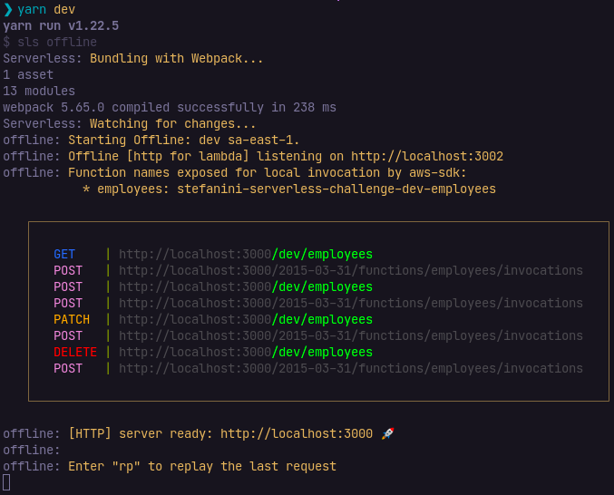

# Stefanini Serverless Challenge

[](https://insomnia.rest/run/?label=Stefanini%20Serverless%20Challenge%20(Matheus%20Rocha)&uri=https%3A%2F%2Fgithub.com%2Fmrocha98%2Fstefanini-serverless-challenge%2Fblob%2Fmain%2Fdocs%2Finsomnia.yml)

Essa é a minha solução para o desafio proposto no repositório <https://github.com/dornellas13/serverless-challenge>.

## Arquitetura

- Infra: nodejs14.x, TypeScript, Serverless Framework e DynamoDB;
- Código: tentei seguir um padrão parecido com o do [NestJS](https://nestjs.com/).
- SWC: optei pela utilização do [transpilador SWC](https://swc.rs/) em vez do Babel visando menos tempo de build.

## Preparando o ambiente

Não realizei deploy da lambda, então é necessário que o projeto seja executado localmente.

Certifique-se de possuir o NodeJS na versão apropriada:

```sh
nvm install
```

Certifique-se de possuir o gerenciador de pacotes Yarn v1:

<https://classic.yarnpkg.com/en/docs/install>

Clone o repositório no local de sua preferência e instale as dependências:

```sh
yarn install --pure-lockfile
```

### Configurando credenciais

Caso não tenha credenciais da AWS salvas no seu ambiente, será necessária a execução dos seguintes comandos:

```sh
npm i -g serverless
sls config credentials --provider aws --key=SUA_KEY --secret SEU_SECRET
```

Sendo __"SUA_KEY"__ e __"SEU_SECRET"__ valores obtidos na criação de um IAM da AWS.

## Executando a aplicação

Primeiro é necessário preparar o DynamoDB local.

```sh
sls dynamodb install
yarn db:start
```

Prepare as variáveis de ambiente:

```sh
cp -r .env.example .env.local
```

Agora basta iniciar a lambda em outro terminal:

```sh
yarn dev
```

Você deve ter um resultado próximo disso:



Disponibilizei um arquivo YAML do [Insomnia](https://insomnia.rest/) com requisições pré-prontas, baixe [aqui](docs/insomnia.yml).

Caso prefira outra solução, basta executar requisições no endpoint `localhost:3000/dev/employee`. Por exemplo:

```sh
curl \
-X POST http://localhost:3000/dev/employees \
-H 'Content-Type: application/json' \
-d '{"name":"Matheus Rocha","age":23,"role":"Desenvolvedor JS"}'
```

Os verbos aceitos pela lambda são:

- GET
- POST
- PATCH
- DELETE

## Comentários

Utilizei uma nomenclatura diferente do proposto no desafio. Não houve um motivo em especial, apenas quis manter em inglês.

| Desafio     | Implementação |
| ----------- | ------------- |
| Funcionário | Employee      |
| Id          | id            |
| Nome        | name          |
| Idade       | age           |
| Cargo       | role          |

Isso acabou trazendo um problema na hora de atualizar o nome do funcionário, pois `name` é uma palavra reservada para o DynamoDB.
